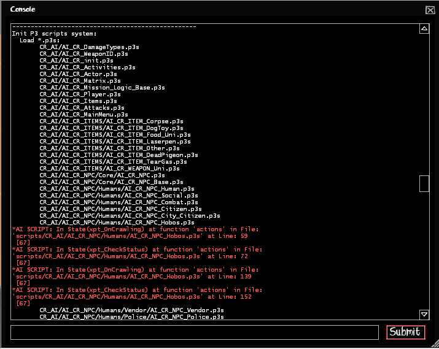
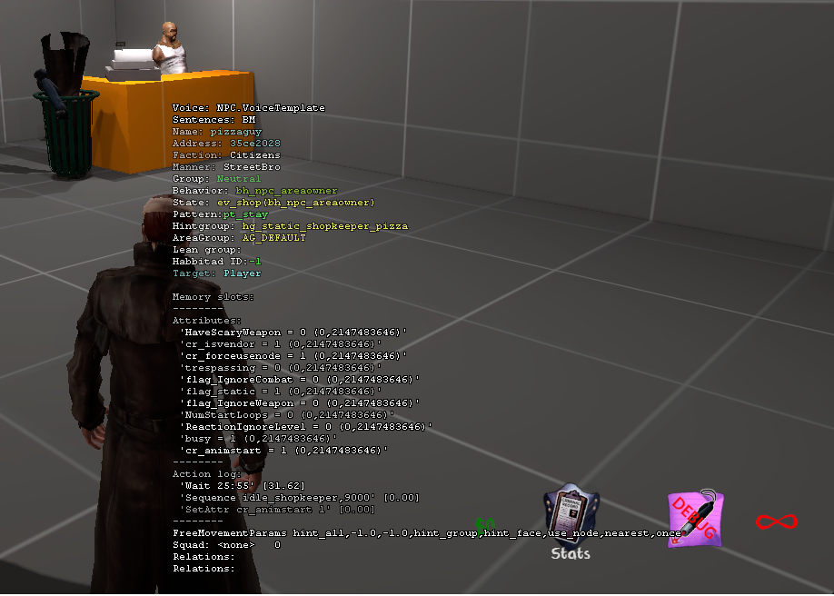
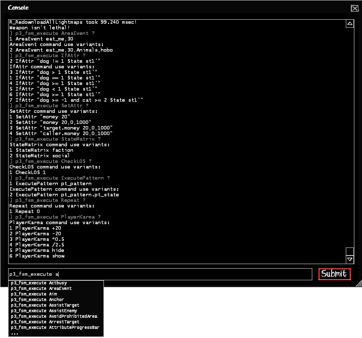

# Debugging

Normally the game doesn't print out any errors, you need to have the <code>developer 1</code>
and <code>p3_fsm_spew 1</code> console commands enabled. Doesn't require full game restart, only map change.

Scrolling around in the console should show you which script are loaded and what lines have errors if there are any, <b>like here so:</b>

If you want to print out your own debug messages, you'll have to settle for doing <code>EntFireInput</code> on the <code>point_clientcommand</code> entity in the map by doing <code>EntFireInput pcc,Command: echo yourmessagehere</code> in p3s.
<b>Here's an example:</b>

<pre><code class="language-js">
pt_mypattern
{
	actions
	{
		// do stuff
		EntFireInput pcc,Command:echo pattern is pt_mypattern
		State st_start
	}
}
</code></pre>

 
## Visual Debugging

With <code>npc_fsminfo</code> you can display an NPC's attributes with values, timers, events, last executed action, and many more: (you should point at an NPC before executing it)

Here are a list of console commands that can be used in combination with that:

<pre><code class="language-js">
// Related to P3S debugging
p3_npc_show_mp
p3_npc_draw_target
p3_squad_debug
p3_npc_draw_squad_relations
p3_range_debug

// Specifically for npc_fsminfo
npc_show_memslots (default is 1)
npc_show_attr (default is 1)
npc_show_events (default is 0)
npc_show_actions (default is 1)
npc_show_timers (default is 0)
npc_show_ea_attr (default is 0)
</code></pre>

 
## External Execution / Help Guide

With <code>p3_fsm_execute</code> or <code>p3_fsm_execute_ex</code> you can execute any Postal3Script function for the Player or an NPC with name externally.
Same rules apply here for P3S limitations!

It will also display EVERY Postal3Script function you can use in a script file, so it is extremely useful.

Must have <code>p3_fsm_spew 1</code> enabled to display use examples!

<b>Note:</b> Sometimes the console commands will not do anything, if that happens you need to load a different map!

<h2>Syntax</h2>

<code class="language-js">p3_fsm_execute [P3S function] [command]</code> -- Will always execute for Players

<code class="language-js">p3_fsm_execute_ex [entity name] [P3S function] [command]</code> -- Will always execute for named NPCs

<h1>Examples</h1>
<pre><code class="language-js">
// Players
p3_fsm_execute State st_mytestingstate
// This will print out tutorials how to use it
p3_fsm_execute SetAttr ?
p3_fsm_execute IfAttr ?
p3_fsm_execute ExecutePattern ?

// Headblob for a named NPC
p3_fsm_execute_ex someguy Headblob 1,HappyCat
// This will kill every someguy NPC
p3_fsm_execute_ex someguy SetAttr "ea_health 0"
</code></pre>

 
## General Advice

If you are not sure how Postal3Script works you can always check the functions on the left, every one of them have examples on their usage and how they work.

Alternatively, like we sometimes do, search through TM's Postal3Script files for a function and try to understand how they work.

I highly recommend to use a program like Notepad++ which is capable of searching through mass of files:

That being said, hopefully this will give you less headache in understanding Postal3Script, and may help you modding the game.

Make sure to keep <a href="../whatispostal3script#limitations">Postal3Script's limitations</a> in mind!
