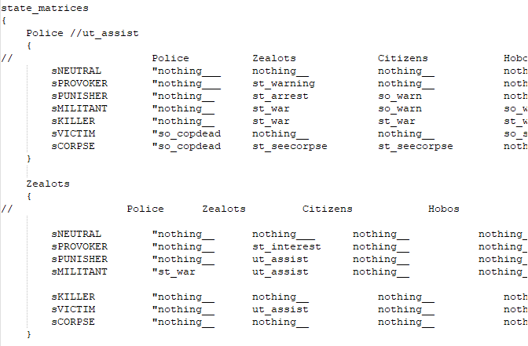
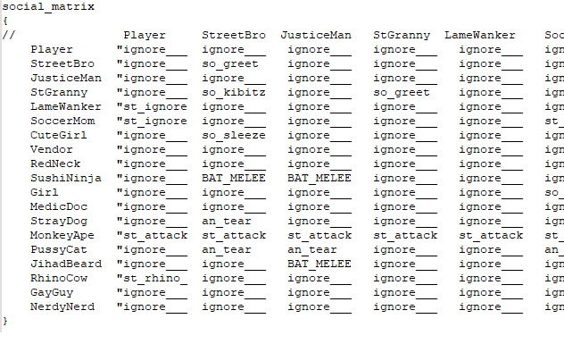

# StateMatrix

Matrix to check through manners, factions, and act accordingly to that

<ul>

Note

<li>To better understand what both matrix do, check out <code>ai_matrix.p3s</code></li>
<li>Heavily used in <code>ai_mission_pw.p3s</code></li>
<li>Function uses target</li>

</ul>

<h1>Syntax</h1>

<code class="language-js">StateMatrix faction</code> -- Goes through Faction matrix, and calls states

<code class="language-js">StateMatrix social</code> -- Goes through Social matrix, and calls states

<h1>Faction Matrix (ai_matrix.p3s)</h1>

 

<h1>Social Matrix (ai_matrix.p3s)</h1>

