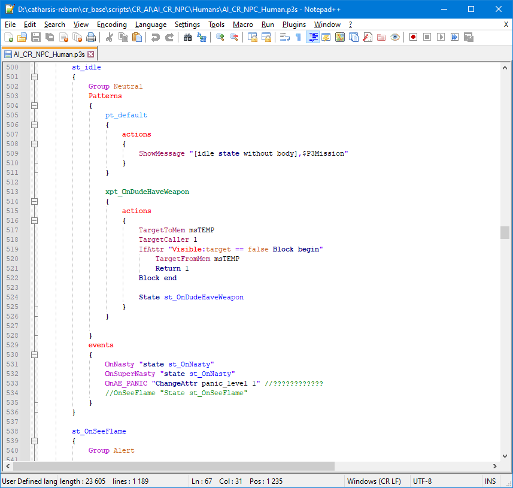
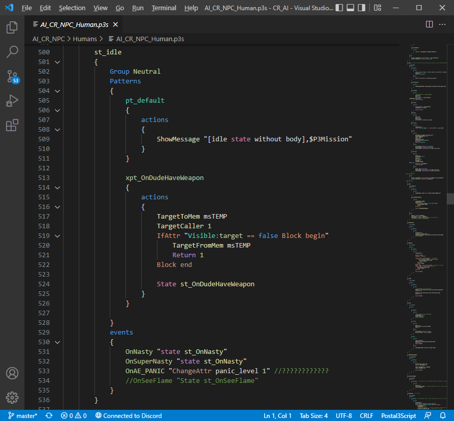

# Syntax Highlighters

We created these syntax highlighters so it's easier to look at p3s code.

## Notepad++

<b>Note:</b> Bracket collapsing isn't properly working, if you wish to use collapsing we recommend to use the syntax highlighter below instead

### Installation

Navigate to <b>'Language->User Defined Language->Open User Defined Language folder...'</b> then drop Postal3Script.xml there, restart Notepad++

<b><a href="https://github.com/Kizoky/postal3script_npp/releases/latest">DOWNLOAD HERE</a></b> (<i>Download as source code</i>)

 
## Visual Studio Code

### Installation

Unpack the zip and create a new folder for it in <b>'C:/Users/[yourusername]/.vscode/extensions'</b>

Ideally it should look like this: <b>'C:/Users/[yourusername]/.vscode/extensions/postal3script.vscode'</b>

Restart vscode when it's done, and it should automatically detect .p3s files

<b><a href="https://github.com/Kizoky/postal3script_vscode/releases/latest">DOWNLOAD HERE</a></b> (<i>Download as source code</i>)
### Alternative Installation

This syntax highlighter can be found in vscode's marketplace if you search for 'Postal3Script'

 